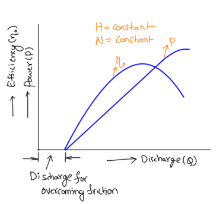

A constant speed is maintained by varying the discharge (by changing spear position) as the load changes. From the measured discharge (Q), head (almost constant), power developed (P) and overall efficiency (ƞo), are calculated and curves are plotted between efficiency (ƞo), power (P) and the discharge (Q).  
7.1	Formulae –  

1.	Discharge (Q) = K Sqrt(h)   LPM 
K is a constant depends on venturi meter dimensions  

2.	Shaft Power/Brake Power developed (B.P) 
B.P = 2πNWRex9.81/60,000    kW 
Where N = speed in RPM 
              W = Load applied on brake drum (N) 
               Re = Effective radius of the brake drum in meters  

3.	Water Power 
W.P = wQH/1000  kW 
Where w = Specific weight of water (9810 N/m3) 
              Q = Discharge in m3/s (as calculated at 1) 
              H = Head (of water) acting on Pelton Turbine  

4.	Overall Efficiency  
ƞo = B.P/W.P  
Procedure  
1.	Change the load on the Hanger (W) and note the reading of the spring balance (S) 
2.	Adjust delivery valve of centrifugal pump to keep head (H) same and adjust spear position to keep RPM same 
3.	With constant speed and almost constant head note still level reading (Hook Gauge reading) 
4.	By using above mentioned steps, change the load from no load to full load and tabulate the readings as given in the Table 1 
5.	Plot operating characteristics with the data obtained  
Observations -  
1.	Mean Diameter of the break drum, D(Dd + Dr) = 200 mm 
Where Dd = diameter of the drum, Dr = diameter of rope 
2.	Speed (RPM) =  
3.	W 
4.	Q = K*Sqrt(H) where K = 21.1  
 
  

