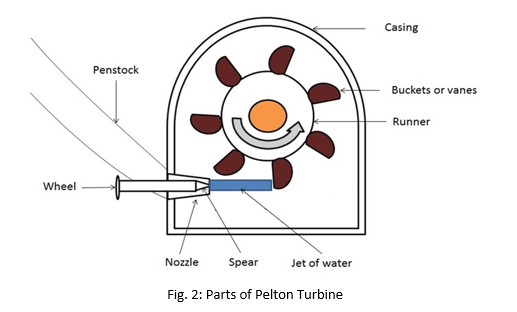
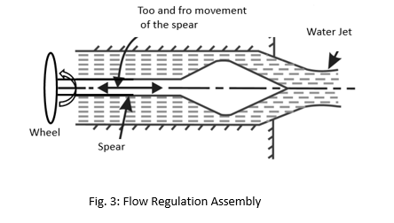

Pelton turbine also known as Pelton wheel which is an impulsive type of hydro-turbine is a prime example of turning kinetic energy of water into rotational energy consequently to work done. Pelton turbine primarily consist of number of buckets arranged around the circumference of a wheel (Runner).  When a fast flow water jet hits the bucket tangentially, the wheel starts to rotate hence turning kinetic energy into rotational kinetic energy. Here impulsive turbine simply means that           Fig. 1: Working Principle of Pelton turbine instead of moving as a result of a reaction force, water creates some impulse on the turbine to get it to move 
 
<i>Fig. 1: Working Principle of Pelton turbine</i>   
<b>Parts of a Pelton Turbine</b> 
 
<i>Fig. 2: Parts of Pelton Turbine</i>  
<b>Nozzle and Flow Regulating Assembly (Spear)</b> 
 
<i>Fig. 3: Flow Regulation Assembly</i> 
•	Nozzle is used to increase the kinetic energy of the water that is going to strike the buckets or vanes attached to the runner 
•	The quantity of water that strikes the buckets is controlled by spear. The spear is installed inside the nozzle and regulates the flow ofwater that is going to strike on the vanes of the runner. A nozzle containing spear is shown in the figure given above 
•	The spear is a conical needle present in the nozzle. It is operated by a hand wheel or automatically in an axial direction 
•	When the spear is moving backward the rate of flow of water increases and when it is pushed forward the rate of flow of water decreases  

<b>Runner and Buckets</b>  
 
 <i>Fig. 4: Runner and Bucket</i> 
The runner with buckets is shown in the figure given above. 
•	Runner is a rotating part of the turbine. It is a circular disc on the periphery of which a number of buckets evenly spaced are fixed. 
•	The buckets are made by two hemispherical bowls joined together. Each bucket has a wall in between two hemispherical bowl called splitter. 
•	The splitter splits the jet of water striking the buckets into two equal parts and the jet of water comes out at the outer edge of the bucket. 
•	The buckets are designed in such a way that the jet of water strikes the buckets, deflected through 160o to 170o 
•	The buckets of the Pelton turbine are made up of cast iron, cast steel bronze or stainless steel 
•	An undercut is provided on bottom portion of buckets. This makes sure that water jet will not get interfered by other incoming buckets  
<b>Casing</b>  
The outer covering of this turbine is called casing. The Pelton turbine with the casing is shown in the Fig. 2. 
•	It prevents the splashing of the water and helps to discharge the water to the trail race. It also acts as a safeguard in the case of an accident occurs 
•	Cast iron or fabricated steel plates are used to make the casing of the Pelton Turbine  
<b>Breaking Jet</b>  
 <i>Fig. 5: Breaking Jet</i>  
•	In order to stop the runner in the shortest possible time, a small nozzle is provided which directs the jet of water at the back of the vanes. This jet of water used to stop the runner of the turbine is called breaking jet. 
•	Additionally, in case of emergency a deflector is also provided in spear assembly which diverts the water jet away from the buckets and reduces the speed of the runner without releasing the pressure  
<b>Penstock<b>  
A penstock is a pipe that conveys the flow from the storage to the turbine. The potential energy of water at the storage tank is converted into kinetic energy at the turbine via the penstock pipe.  
<b>Governor Mechanism</b> 
The speed of the turbine runner is required to be maintained constant so that the electric generator can be coupled directly to the turbine. Therefore, a device called governor is used to measure and regulate the speed of the turbine runner. 
<b>Working of Pelton wheel:</b> 
•	The water stored at a high head is made to flow through the penstock and reaches the nozzle of the Pelton turbine. 
•	The nozzle increases the K.E. of the water and directs the water in the form of a jet 
•	The jet of water from the nozzle strikes the buckets (vanes) of the runner. This made the runner to rotate at very high speed 
•	The quantity of water striking the vanes or buckets is controlled by the needle valve present inside the nozzle 
•	The generator is attached to the shaft of the runner which converts the mechanical energy of the runner into electrical energy  
<b>Head Types</b>  
 
 <i>Fig. 6: Various Head Types</i> 
<b>Gross Head (Hg):</b>
The gross head is the difference between the water level at the reservoir and the water level at the tailrace. It is denoted by Hg.
Net or Effective Head (H): 

<b>Net or Effective Head (H):</b> 

The head available at the inlet of the turbine is known as the net or effective head. It is denoted by H and is given by H=Hg-hf   

 
where hf = total loss of head due to friction during the transit of water from headrace to tailrace and is given by:  
Where, 
 f = coefficient of friction of penstock depending on the type of material of penstock 
 L = total length of penstock 
 V = mean flow velocity of water through the penstock 
 d = diameter of penstock and 
 g = acceleration due to gravity  
 <b>Efficiencies of Pelton Turbine</b>  
 Hydraulic Efficiency:  
 It is defined as the ratio of power developed by the runner to the power supplied by the jet at the entrance to the turbine. Mathematically,  
   
 <b>Mechanical Efficiency</b>  
 It is defined as the ratio of the power obtained from the shaft of the turbine to the power developed by the runner.  
 These two powers differ by the number of mechanical losses, viz, bearing friction, etc  
   
 <b>Volumetric Efficiency</b>  
 The volumetric efficiency is the ratio of the volume of water actually striking the runner to the volume of water supplied by the jet to the turbine.  
   
 <b>Overall Efficiency</b>  
 It is defined as the ratio of the power available at the turbine shaft to the power supplied by the water jet. 
 

